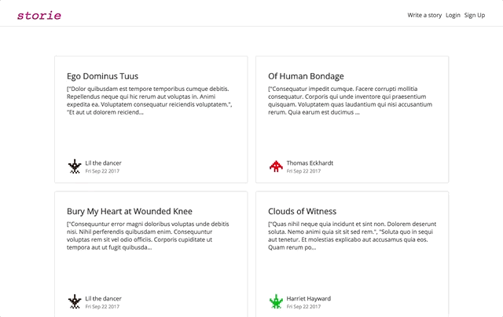
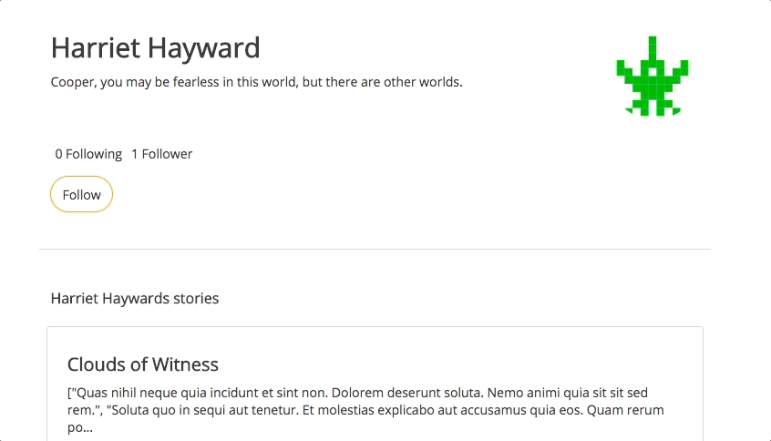
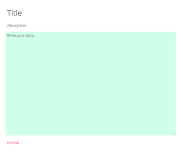
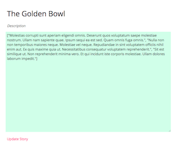
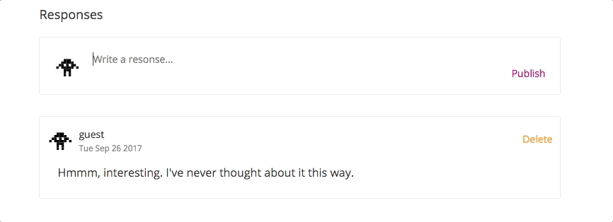

# Storie

http://storie.press

Storie is a minimalist site to write, read, and comment on stories. It is somewhere between Medium, LiveJournal, and Facebook. Storie is a single page web app built with React.js and Redux on the frontend, a PostgreSQL database, and Ruby on Rails in the backend.

## Features
* Secure sign up and login. Passwords are encrypted using BCrypt. The site keeps track of returning users' logins with the help of session tokens stored in the client's browser.
* Stories are the heart of Storie: Users create, edit and share stories.
* Users can follow others and comment on their posts.
* Profile pictures are generated using [tinygraphs](https://github.com/taironas/tinygraphs). The images use tinygraph’s space invaders option with the output is based on username string and a randomly generated color. They're fun and it gives the site a colorful but unified look.
* The site's design is responsive and optimized for mobile use. The mobile version uses the reduced screen space more efficiently, and provides larger fonts for easy viewing.

### Stories
Storie is text focused. It is foregoing post header images as they often only marginally related to the writing. No images for the sake of having an image. The same goes for likes. They say more about marketing than quality, and popular does not equal good.

#### Comments
Story and Comment forms auto expand and contract with text size, so users always have a full view of what they’ve typed.

#### Follows
Users can follow and unfollow others. The button toggles neatly between the two.

#### Story Write & Edit
The background color of the Story Writer is a light yellow green, which people tend to find to be more eye friendly than white. Think legal pads and the beautiful National Brand notebooks.

 

#### Formatting links & breaks
In an effort to have writers focus on text over formatting, bolding, italics, colors, and the like aren't provided at this point. However, web links are parsed and rendered with the help of [Linkify](https://github.com/tasti/react-linkify/), a simple match and parse library.

Story posts also honor paragraphs and line breaks, with the help of modern CSS `white-space: pre-line;`

Instead of being feature heavy, the idea of the site was to be simple and working, smooth and bug free.

## Future Features
* At least three privacy settings: Users should be able to post publicly, friends only, and privately.
* A limited wysiwyg text editor for the “write story” form. I’d like to keep it simple, but anticipate users' desire for adding inline images to illustrate concepts, or convey moods, or simply share personal photos or art.
* Profile customization, if desired by users.
